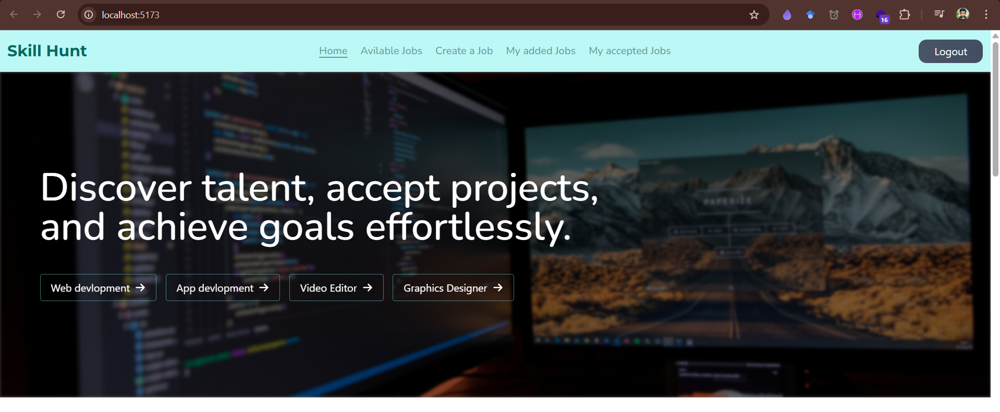
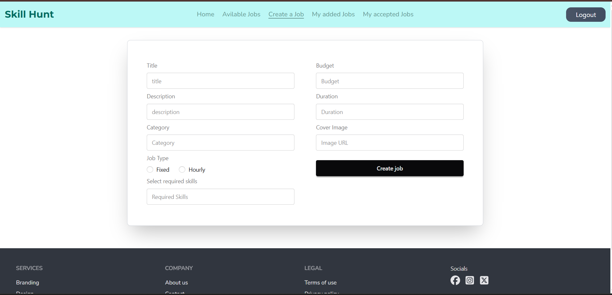
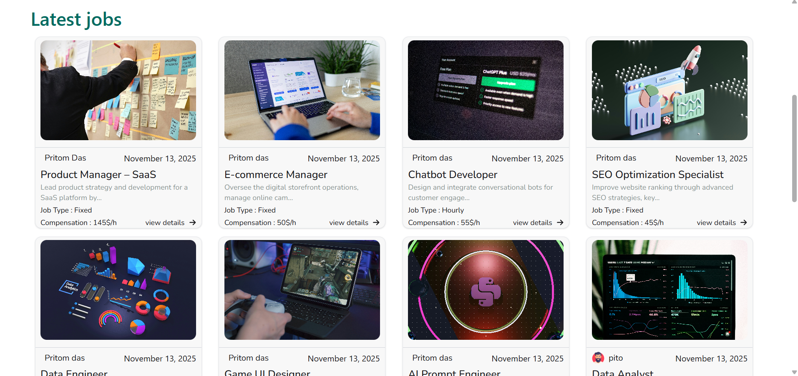

# About 

SkillHunt is a comprehensive platform that connects clients with skilled freelancers across various domains, making project collaboration easier than ever. Clients can post projects, review freelancer profiles, and manage proposals, while freelancers can bid on projects, showcase their skills, and deliver work efficiently. The platform is designed to simplify the hiring process, ensure transparent communication, and facilitate secure payments between clients and freelancers.
<p >
  Checkout the website live at : https://skillhunt-42e28.web.app/
</p>

## Screenshots

### Landing Page


### Create a Job



### Latest jobs


## Main Features

- **User Authentication:** Secure sign-up and login using Firebase Authentication.
- **Client Dashboard:** Post projects, manage proposals, and track project status.
- **Freelancer Dashboard:** Browse projects, and manage accepted jobs.
- **Project Management:** Track project progress and deadlines.
- **Secure Payments:** Simplified and secure payment process between clients and freelancers.
- **Interactive UI:** Smooth animations, SweetAlert popups, and responsive design.
- **Routing & Navigation:** Seamless navigation with React Router.
- **Notifications:** Toast notifications for actions like job acceptance, and updates.


## Main Technologies Used

- **Frontend:** React, HTML5, CSS3, JavaScript
- **Routing:** React Router
- **Backend:** Firebase (Authentication, Firestore, Hosting), Express.js
- **State Management:** React Context API 
- **UI & Animations:** SweetAlert, CSS/JS Animations
- **Deployment:** Firebase Hosting
- **Other Tools:** Git, VS Code, Chrome DevTools

## Project Dependencies

- `@lottiefiles/dotlottie-react` ^0.17.7
- `@tailwindcss/vite` ^4.1.17
- `axios` ^1.13.2
- `firebase` ^12.5.0
- `lottie-react` ^2.4.1
- `react` ^19.1.1
- `react-dom` ^19.1.1
- `react-icons` ^5.5.0
- `react-router` ^7.9.5
- `react-toastify` ^11.0.5
- `sweetalert2` ^11.26.3
- `swiper` ^12.0.3
- `tailwindcss` ^4.1.17

  ## How to Run Locally

Follow these steps to run the project on your local machine:

1. **Clone the repository**
```bash
git clone https://github.com/your-username/your-repo-name.git
cd your-repo-name
```
2. **Install dependencies**
 ```bash
 npm install
 ```
3. **Set up Firebase**

Make sure you have a Firebase project.

Create a .env file in the root directory and add your Firebase configuration:
```bash
REACT_APP_FIREBASE_API_KEY=your_api_key
REACT_APP_FIREBASE_AUTH_DOMAIN=your_auth_domain
REACT_APP_FIREBASE_PROJECT_ID=your_project_id
REACT_APP_FIREBASE_STORAGE_BUCKET=your_storage_bucket
REACT_APP_FIREBASE_MESSAGING_SENDER_ID=your_messaging_sender_id
REACT_APP_FIREBASE_APP_ID=your_app_id
```
4. **Run the development server**
```bash
npm run dev
```


